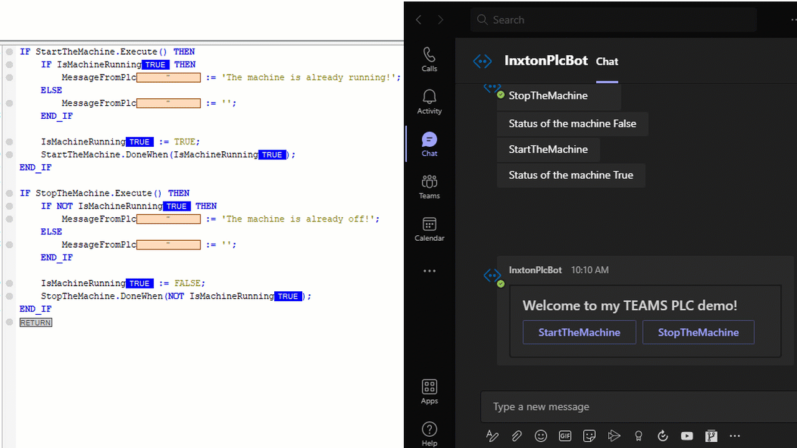

# How to control PLC from MS TEAMS

> This a repository from a live coding session. 

 Demonstrates how to use Inxton, TcOpen and Beckhoff TwinCAT 3 PLC to interact with MS Teams Bot.

 

Sample that I used to get started  - https://docs.microsoft.com/en-us/azure/bot-service/bot-service-quickstart-registration

## How to run the bot

1. Open Visual Studio
1. Run the project `TeamsConversationBot` 
1. Run ngrog : `ngrok http -host-header=rewrite 3978`
1. Create [Bot Framework registration resource](https://docs.microsoft.com/en-us/azure/bot-service/bot-service-quickstart-registration) in Azure
    - Use the current `https` URL you were given by running ngrok. Append with the path `/api/messages` used by this sample
    - Ensure that you've [enabled the Teams Channel](https://docs.microsoft.com/en-us/azure/bot-service/channel-connect-teams?view=azure-bot-service-4.0)
    - **If you don't have an Azure account** you can use this [Bot Framework registration](https://docs.microsoft.com/en-us/microsoftteams/platform/bots/how-to/create-a-bot-for-teams#register-your-web-service-with-the-bot-framework)
1. Update the `appsettings.json` configuration for the bot to use the Microsoft App Id and App Password from the Bot Framework registration. (Note the App Password is referred to as the "client secret" in the azure portal and you can always create a new client secret anytime.)
1. Download the PLC project to localhost
    - If you don't have TcOpen.Core installed, install it from `TwinTeams\lib` folder.
1. Get the free inxton licence at inxton.com
1. Use the url from the Teams channel to open the bot in MS Teams and enjoy!